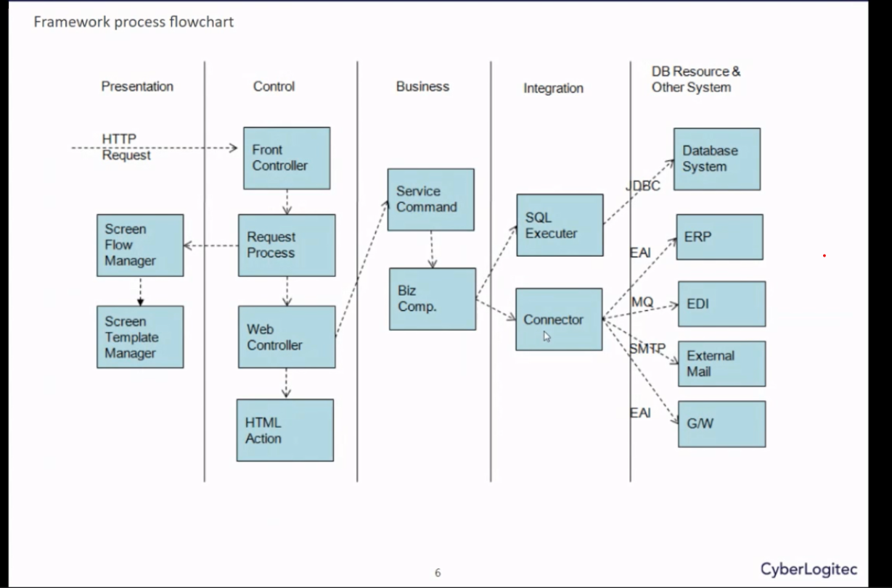
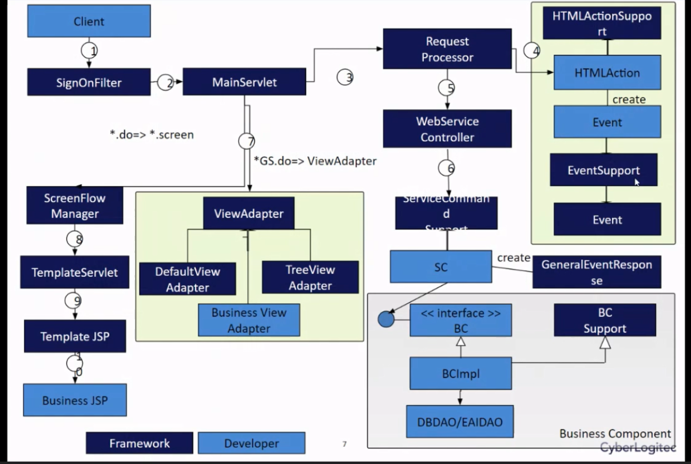
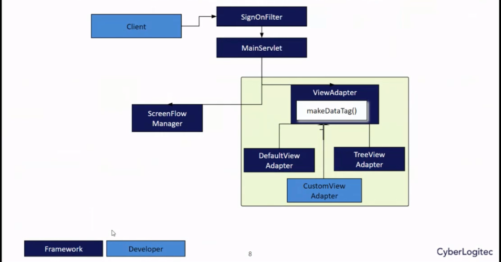
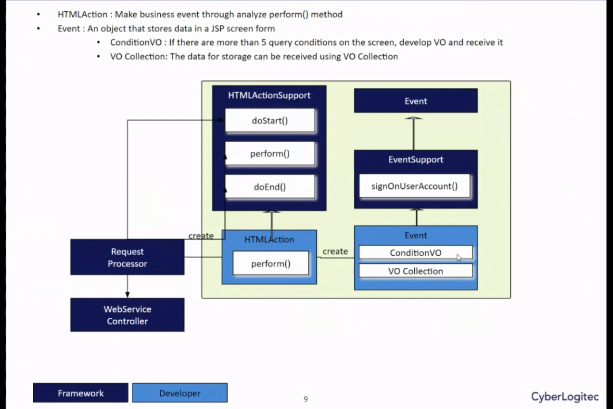
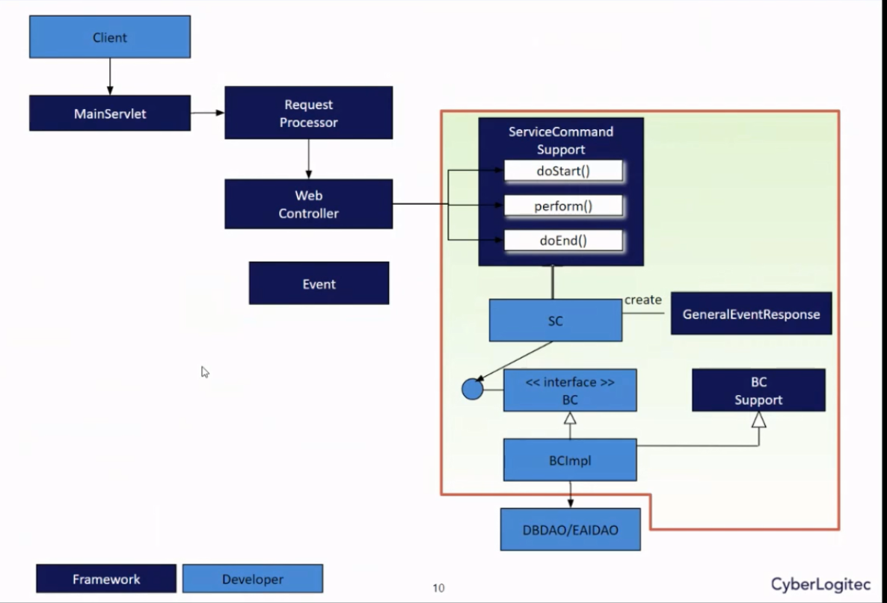
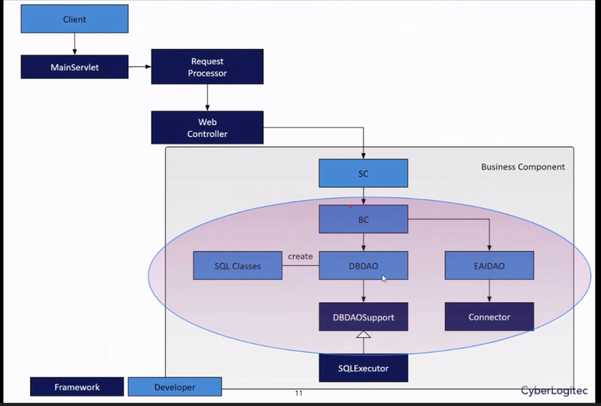

## Framework

### Synapse framework

1. Framework outline

- Chanel
  - Able to have multi chanel
  - Web
    - Web application
  - Web service
    - Apis
- Biz App (model)
  - Total 39 modules
    - BKG
    - INV
    - Manifest
    - PRI
    - DMT
    - CTM
    - TRS
    - CIM
    - ......
- Business common
  - Location
  - Code
  - Country
  - Approval
- System common
  - Mail/fax
  - File UP/DOWN
  - FTP
  - File create
- General synapse framework
  - ErrorHandler
  - Backend Job
  - Log/Message
  - Control class
  - Security
  - Configuration
  - Utility check
  - Template
  - Foundation class
- Connector
  - Able to have multi
  - DB connector
  - EAI connector
  - Queue connector
- WAS
  - Weblogic server

**Layer**

- Presentation layer
  - Receives request from client creates the screen
  - Processes and transmits the request data on the screen.
- Control Layer
  - Serves as an Interceptor process for all business processes
  - Play a role of session management and filter role
  - Determines the continuation of application processing by the user's login
    policy and authority information
- Business layer
  - Performs the business process in response to the user's job request ad
    requests the processing of the data
- Integration layer
  - A layer for interfacing a database and an external system
  - Responsible for calling service of other business components and external
    systems at the request of the business layer.
- Resource layer
  - A platform area that provides the physical resources of the system, such as
    file systems and databases.

**Flowchart**

- **Concept**

- SignOnFilter

  - Authentication
  - Authorization

- MainServlet

  - Control 2 request

    - `*GS.Do=>ViewAdapter`
      - Call Data, some action, follow up to view ViewAdapter
      - View Adapter
        - DefaultView Adapter (main)
        - TreeView Adapter
        - Help convert data types to XML (PARSE DATA So framework will be able to read) then display on Business View Adapter
    - `_do=>_\_.screen` (load page)
      - Check view mapping
      - Work with ScreenFlowManager
      - ScreenFlowManager
        - Handle to request view get template
      - TemplateServlet, Template JSP, Business JSP
        - Work with template and display request view

- Request processor

  - Working with HTMLAction to verify request's action

- HTML Action

  - Implement from HTMLActionSupport
  - Create Event
  - Get back with Request Processor to hand over request mapping

- Event

  - Implement action event

- WebService Controller

  - Take request mapping from Request processor
  - Call Service Command Support

- SC

  - Check request, requirements, output?

- BC (interface)

  - methods container

- BCImpl
  - Integrate with DBDAO/EAIDAO
  - DBDAO
    - Integrate with database
  - EAIDAO
    - Integrate with other connections
      - Send email/fax
      - Ftp
      - ....

2. Presentation Layer

- A layer that displays user screen or IBSheet result data.
  - DefaultScreenFlowManager: Forward `*.do` request to `*.screen` URL
  - ViewAdapter : Abstract class which is change IBSheer request to XML format
    - ViewAdapter: Make default Xml form
    - TreeViewAdapter: Make tree view XML form
    - CustomViewAdapter: Newly developed and used in the form desire by the developer
      

3. Control Layer

- HTMLAction
  - Implement HTMLActionSupport
    - doStart()
    - perform() (main)
    - doEnd()
  - Make business event through analyze perform() method
- Event: An object that store data in a JSP screen form

  - ConditionVO
    - receive request
    - if there are more than 5 query conditions on the screen, develop VO and receive it
  - VO Collection:

    - return request's data
    - the data for storage can be received using VO collection
      

4. Business Layer (MVC)

- They are service classes
- Handle business related requests
- SC (service command)
  - Convert request to command (ex: We don't need to use http GET, POST. They will be convert to specify commands of framework to handle request)
  - Create event respond to GeneralEventResponse
    - PARSE data to XML and display.
- BC (Business component)

  - work with DBDAO/EAIDAO to return Data

    

5. Integration Layer

- Only integrate with database
  - connect to database - query, get result
    
