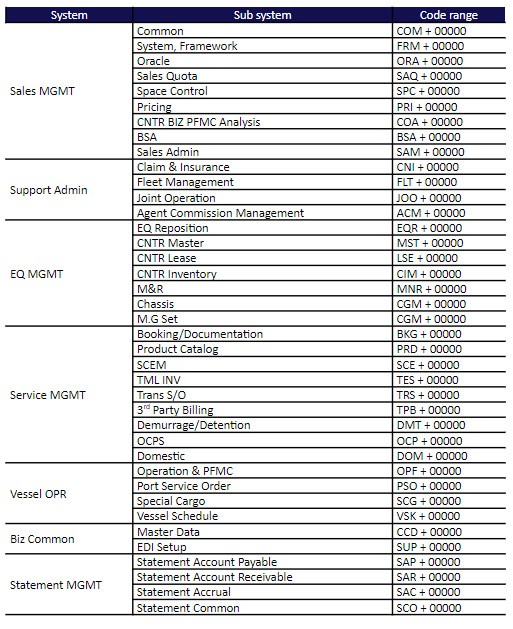
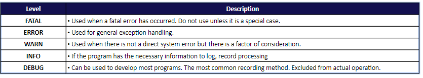

# Exception and Logging
## Exception
### Standard
  - The message should be easy to understand
  - Error message is managing with code like “COM00000”
  - Exception’s purpose is so that the developer can accurately determine the error location
### Overview
  - When an exception occurs, it may be necessary to send an error message or go to the error screen.
    - Provide the user with processing error through the javascript on the screen.
    - Errors in the framework provide an error message to the user with error screen.
### Management
- Exception code store in java script message file and DB
  - js message file
    - common way to handle validation
    - Processes the message before the business transaction
    - Co{module}.js
  - DB
    Process message during business logic processing
- We are not show message "string" directly, only use message code and modules
### Scope
- Presentation Layer
  - Handle Error or Confirm message about presentation layer

  - Error handling, verification of input items and confirmation of business process in presentation layer

  - Save it as a JS file or code directly into the script

- Service Layer
  - Exception or message from service layer is processed when loading JSP page

  - Exceptions in the service layer(SC, BC, DAO) are delivered through predefined object. The delivered object is received from the presentation layer and sends a message through an alert according to whether there is an error.

  - Every exception code is stored in DB
### Code range
- The message file exists for each module.
- The following method is recommended for the message code.
- Modules can be added and changed depending on the scope of the system.

## Logging
### Level

- In test server, log level is used as debug mode, but in Production environment, it is used as INFO, WARN, ERROR
- The batch program uses the INFO level
