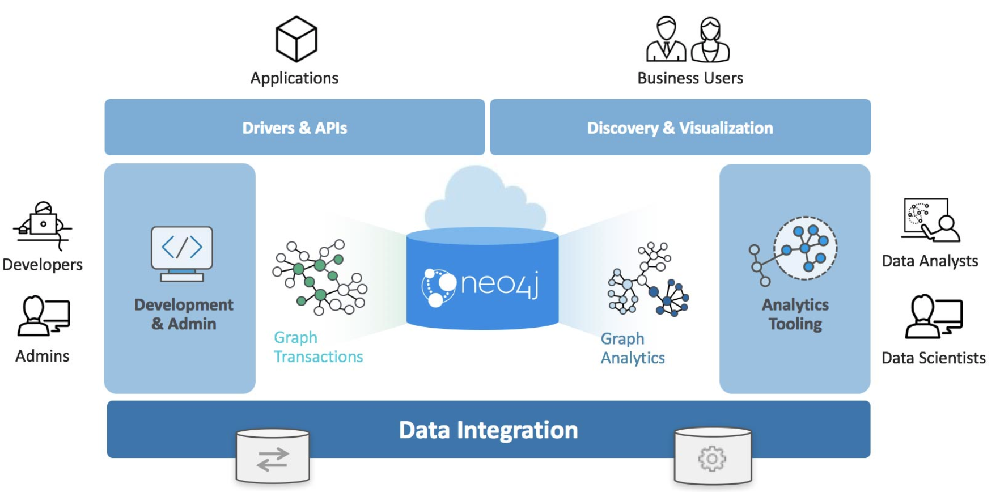

# 07/26/2022

## Company

## Personal

Neo4j Graph Platform

- Includes components that enable you to develop your graph-enabled application.

- Used by developers, administrators, data analysts, and data scientists to access application data.1
- Developers
  - Create the data in the graph by either importing it into the graph or using the Cypher language to implement the data model
  - Developers are responsible for integrating the graph with other systems and database management system (DBMS) installations.
- Admins
  - manage the processes and files related to the Neo4j installation.
- Data scientists and data analysts
  - typically use a combination of Cypher queries, as well as tools, to analyze the data.
- End-users
  - typically use applications written by developers to access the graph data.

## TODO

- Document standby có 9 tab
  - nhin vao booking co the biet dc co dinh standby(authorization) hay ko cac tab la cac constrain
