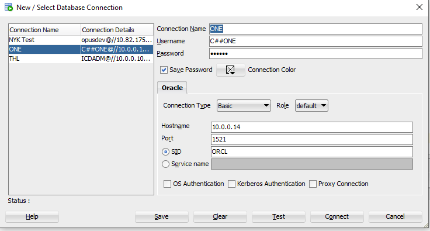

# SQL Practice

Database test


## Câu 1: Giải thích các hàm thông dụng sau

| Stt | Tên Hàm      | Mục đích sử dụng & nên sử dụng khi nào                                                                 |
| --- | ------------ | ------------------------------------------------------------------------------------------------------ |
| 1   | Count()      | - Trả về số dòng (số lượng) phù hợp với một tiêu chí cụ thể.                                           |
|     |              | - Nên dùng khi cần đếm số lần xuất hiện của một tiêu chí nào đó, hoặc check tồn tại của một đối tượng. |
| 2   | Sum()        | - Tính tổng giá trị của một cột (chỉ dùng cho cột giá trị số)                                          |
| 3   | MAX()        | - Tìm giá trị lớn nhất trên cột                                                                        |
| 4   | MIN()        | - Tìm giá trị nhỏ nhất trên cột                                                                        |
| 5   | NVL()        | - Dùng để test một String xem nếu có null thì thay thế bằng một chuỗi khác                             |
| 6   | TO_CHAR()    | - Chuyển đổi một giá trị bất kỳ sang kiểu String                                                       |
| 7   | T0_DATE()    | - Chuyển định dạng của một chuỗi hoặc một dãy số sang định dạng ngày tháng.                            |
| 8   | TO_NUMBER()  | - Chuyển đổi kiểu dữ liệu CHAR, VARCHAR2, NCHAR hoặc NVARCHAR2 thành kiểu dữ liệu NUMBER               |
| 9   | SUBSTR()     | - Lấy ra chuỗi phụ từ chuỗi lớn                                                                        |
| 10  | REPLACE()    | - Thay thế một ký tự/chuỗi bằng một chuỗi khác                                                         |
| 11  | REVERSE()    | - Đảo ngược chuỗi ký tự                                                                                |
| 12  | DECODE()     | - Bản chất là IF – THEN – ELSE function, hay case switch                                               |
| 13  | TRUNC()      | - Thu gọn một số đến một vị trí nào đó sau dấu phẩy (vị trí được chỉ định bởi tham số truyền vào)      |
| 14  | LENGTH()     | - Trả về dộ dài của chuỗi được truyền vào                                                              |
| 15  | LPAD()       | - Trả về một chuỗi mới. (ví dụ: LPAD(‘ABC’,6) -> result: ‘ ABC’)                                       |
| 16  | RPAD()       | - Trả về một chuỗi mới. (vi dụ: RPAD(‘ABC’,6) -> result: ‘ABC ‘)                                       |
| 17  | TRIM()       | - Loại bỏ các ký tự giống ký tự được chỉ định từ đầu hoặc cuối của chuỗi                               |
| 18  | LTRIM()      | - Loại bỏ các ký tự giống với ký tự được chỉ định từ phía bên trái của chuỗi                           |
| 19  | RTRIM()      | - Loại bỏ các ký tự giống với ký tự được chỉ định từ phía bên phải của chuỗi                           |
| 20  | ROUND()      | - Trả về một số được làm tròn đến chữ số thập phân được chọn                                           |
| 21  | ADD_MONTHS() | - Trả về một date được sau khi được cộng vào số tháng được chọn                                        |

## Câu 2:

```sql
SELECT *
FROM MDM_CUSTOMER A
WHERE A.CUST_LGL_ENG_NM LIKE ‘%\_LOGISTICS%’ ESCAPE ‘\’
ORDER BY A.CUST_LOCL_LANG_NM NULLS FIRST
```

A) Vui lòng giải thích ý nghĩa của câu SQL trên:

- Hiển thị tất cả các cột trong bảng mdm_customer theo điều kiện và sắp theo cột locl_lang_nm với các giá trị null ở các dòng đầu tiên.
  B) ý nghĩa của việc dùng ESCAPSE:
- Biến ký tự sau escape trở thành ký tự bình thường
  C) Ý nghĩa của việc dung Nulls First:
- Để những ô null lên đầu tiên
  D) Ý nghĩa của việc dung alias, có nên dung alias trong mọi trường hợp không?
- Giúp đặt tên ngắn, dễ viết.
- Không nên dùng alias cho mọi trường hợp

## Câu 3:

```sql
SELECT *
FROM MDM_CUSTOMER
WHERE 1 = 1
  AND CUST_CNT_CD = 'JP'
  AND TO_CHAR(CUST_SEQ) = '201791'
```

Theo bạn câu trên cách dùng `TO_CHAR(CUST_SEQ) = '201791'` có hợp lý không, tại sao?

- Không hợp lý. Mặc dù kết quả có thể đúng nhưng sẽ mất index.

## Câu 4: cho câu SQL và kết quả như hình bên dưới


A) Giải thích ý nghĩa ` COUNT(*), COUNT(1), COUNT(CUST_LOCL_LANG_NM)`

- Count(\*): đếm tổng số hàng trong bảng, bao gồm các giá trị null
- Count(1): gán giá trị từ dấu ngoặc đơn cho mọi hàng trong bảng rồi đếm đếm tổng số hàng trong bảng, bao gồm các giá trị null
- Count(CUST_LOCL_LANG_NM): Đếm tất cả các hàng trong cột được chỉ định không bao gồm giá trị null

B) Tại sao `COUNT(CUST_LOCL_LANG_NM)` lại bằng 0:

- Vì tất cả các hàng đều null

## Câu 5: có 2 cách như bên dưới, cách nào tốt tại sao

| Cách 1             | Cách 2             |
| ------------------ | ------------------ |
| `NVL(SUM(COL1),0)` | `SUM(NVL(COL1,0))` |

- Cách 1 tốt hơn. Vì cách 1 chạy nhanh hơn (test trong sqldeveloper tool)

## Câu 6: có 2 cách như bên dưới, cách nào tốt tại sao

| Cách 1                                | Cách 2                          |
| ------------------------------------- | ------------------------------- |
| `NVL(SUM(COL1),0) + NVL(SUM(COL2),0)` | `Ex.1] SUM(NVL(COL1 + COL2,0))` |
|                                       | `Ex.2] NVL(SUM(COL1 + COL2),0)` |

- 1 + NULL = NULL, nên nếu dùng giá trị từ 2 cột có giá trị null với cách (col1 + col2) sẽ ra sai kết quả

## Câu 7: có 2 cách như bên dưới, cách nào tốt tại sao

Cách 1

```sql
SELECT A.CUST_NO, A.ORD_NO, A.PRO_CD, B.PROD_NM
FROM TB_ORD A,
  TB_PROD B
WHERE 1 = 1
  AND A.PRO_CD = B.PROD_CD
  AND B.PROD_CD IN (SELECT PROD_CD
NVL(SUM(COL1),0) + NVL(SUM(COL2),0) Ex.1] SUM(NVL(COL1 + COL2,0))
```

Cách 2

```sql
SELECT A.CUST_NO, A.ORD_NO, A.PRO_CD, B.PROD_NM
FROM TB_ORD A,
  TB_PROD B
WHERE 1 = 1
  AND A.PRO_CD = B.PROD_CD
  AND EXISTS (SELECT D.PROD_CD FROM
```

- Cách 1 tốt hơn vì cách 1 cost thấp hơn
- Dùng IN khi kết quả truy vấn phụ nhỏ, dùng EXISTS khi kết quả truy vấn phụ lớn

## Câu 8: có 2 cách như bên dưới, cách nào tốt tại sao

Cách 1

```sql
SELECT A.CUST_NO,
       A.ORD_NO,
       A.PRO_CD,
       B.PROD_NM
FROM TB_ORD A,
     TB_PROD B
WHERE 1 = 1
  AND A.PRO_CD = B.PROD_CD
  AND B.PROD_CD IN ('00001',
                    '00002');
```

Cách 2

```sql
SELECT A.CUST_NO,
       A.ORD_NO,
       A.PRO_CD ,

  (SELECT B.PROD_NM
   FROM TB_PROD B
   WHERE B.PROD_CD = A.PRO_CD) AS PROD_NM
FROM TB_ORD A
WHERE 1 = 1
  AND A.PRO_CD IN ('00001',
                   '00002');
```

```sql

```

## Câu 9: cho số 8988.80 vui lòng xuất ra định dạng $8,988.800

```sql
SELECT TO_CHAR (8988.80,
                '$9,9999.999')
FROM dual;
```

## Câu 10: cho số 8988.80, 820988.80 vui lòng xuất ra định dạng $8,000.000, $820,000.000

```sql
SELECT to_char(trunc(8988.80, -3), 'L9G999G999D00')
FROM dual;
```

```sql
SELECT to_char(trunc(820988.80, -3), 'L9G999G999D00')
FROM dual
```

## Câu 11: Cho cấu SQL và kết quả như sau:


Như hình trên cả 2 A và B điêu substr từ 1, đến 3 tại sao kết quả lại khác nhau.
 Tại độ dài của to_char(98765,’fm00000’) là 5 số và độ dài của to_char(98765,’00000’) là 6 số. Do fm loại 1 khoảng trắng dành để biểu diễn dấu + - trong 1 chuỗi số trả về.

## Câu 12: Viết Câu SQL xuất ra, Ngày hiện tại, này hôm qua, ngày mai

```sql
SELECT sysdate + interval '-1' DAY AS YESTERDAY,
       sysdate AS NOW,
       sysdate + interval '1' DAY AS TOMORROW
FROM dual
```

## Câu 13: ta có table (TB_ORD), yêu cầu viết câu SQL để generate ORD_NO có đô dài 10 tự với format sau: yyyymmdd000Seq, ví dụ hnay là 20191028 và chưa có seq nào thì ORD_NO sẽ là 201910280001, và nếu đã tồn tại ORD_NO 201910280001 thì nó sẽ là 201910280002

```sql
SELECT concat(to_char(SYSDATE, 'yyyyMMdd'),
                (SELECT to_char(count(*) + 1, 'fm0000')
                 FROM tb_ord
                 WHERE ord_dttm like concat(to_char(SYSDATE, 'yyyyMMdd'), '____')))
FROM tb_ord
WHERE ROWNUM = 1
```

## Câu 14: ta có table (MDM_CUSTOMER) và dữ liệu như bên dưới


Các field liên quan: CUST_CNT_CD, CUST_SEQ, CUST_GRP_HRCHY_CD, CUST_GRP_ID
Dữ liệu cột CUST_GRP_HRCHY_CD có thể có(I: individual, C: Country, G: Global)
A) Viết câu SQL tìm CUST_GRP_ID sao cho: CUST_GRP_HRCHY_CD có I hoặc C nhưng không có G
select distinct(CUST_GRP_ID)
from mdm_customer
where CUST_GRP_ID not in (
select CUST_GRP_ID
from mdm_customer
where cust_grp_hrchy_cd like 'G'
)

B) Viết câu SQL tìm CUST_GRP_ID sao cho: CUST_GRP_HRCHY_CD có G và có I nhưng không có C

```sql
select
  distinct(CUST_GRP_ID)
from
  mdm_customer
where
  CUST_GRP_ID not in (
    select
      CUST_GRP_ID
    from
      mdm_customer
    where
      cust_grp_hrchy_cd like 'C'
  )
```

## Câu 15: ta có table (TB_PROD) và dữ liệu như bên dưới


Viết câu SQL để suất ra kêt quả như sau:

1. Lấy `max(PROD_UNIT_AMT)`

```sql
SELECT max(PROD_UNIT_AMT)
FROM tb_prod;
```

2. Lấy giá trị `min(PROD_UNIT_AMT)`

```sql
SELECT min(PROD_UNIT_AMT)
FROM tb_prod;
```

select min(PROD_UNIT_AMT) from tb_prod; 3. Lấy giá trị trung bình PROD_UNIT_AMT
select avg(PROD_UNIT_AMT) from tb_prod; 4. Lấy tên của sản phẩm có PROD_UNIT_AMT lớn nhất
select prod_unit_amt as MAX_AMT, prod_nm as MAX_NAME, a.minp as MIN_AMT, a.avgp as AVG
from tb_prod, (select max(PROD_UNIT_AMT) as MAXP, min(PROD_UNIT_AMT) as MINP, avg(PROD_UNIT_AMT) as AVGP from tb_prod) A
where prod_unit_amt = (select max(PROD_UNIT_AMT) from tb_prod) and tb_prod.prod_unit_amt = a.maxp;
Kết quả phải ra đc như sau:

## Câu 16: ta có table (TB_ORD) và dữ liệu như bên dưới

A) viết cấu SQL lấy ra top3 sản phẩm đc bán nhiều nhất.

```sql
SELECT *
FROM
  (SELECT pro_cd,
          count(pro_cd) AS countp
   FROM tb_ord
   GROUP BY pro_cd
   ORDER BY countp DESC) A
WHERE ROWNUM <= 3;
```

B) Viết cấu SQL lấy ra cái ORD_DT, ORD_TM, PROD_CD gần nhất theo CUST_NO

```sql
SELECT a.cust_no,
       b.ord_dttm,
       a.maxp,
       b.pro_cd
FROM
  (SELECT cust_no,
          MAX(ord_dttm) maxp
   FROM tb_ord
   GROUP BY cust_no) A
LEFT JOIN tb_ord B ON a.cust_no = b.cust_no
AND a.maxp = b.ord_dttm
ORDER BY a.cust_no;
```

Kết quả mong đợi như sau:

C) Viết câu SQL report xem trong tháng 06, 07, 08, 09 cảu 2019 sản phẩm có mã code là 00001bán đc bao nhiêu cái.
Kết quả mong đợi nhưu sau: left outer join partition - 130

```sql
SELECT A.MON,
       NVL(B.pro_cd, '00001') AS PRO_CD,
       NVL(b.total, 0)
FROM
  (SELECT distinct(substr(ord_dttm, 1, 6)) AS MON
   FROM tb_ord
   WHERE substr(ord_dttm, 1, 5) like '20190'
     AND substr(ord_dttm, 6, 1) in ('6',
                                    '7',
                                    '8',
                                    '9') ) A
LEFT OUTER JOIN
  (SELECT A.MON,
          pro_cd,
          count(pro_cd) AS total
   FROM
     (SELECT substr(ord_dttm, 1, 6) AS MON,
             pro_cd
      FROM tb_ord
      WHERE substr(ord_dttm, 1, 5) like '20190'
        AND substr(ord_dttm, 6, 1) in ('6',
                                       '7',
                                       '8',
                                       '9')
        AND pro_cd like '00001' ) A
   GROUP BY MON,
            pro_cd) B ON A.MON = B.MON;
```

D) giả sư lúc đầu sản phẩn 00001 có 100 cái, viết report để tính số lương remain theo tháng 06, 07, 08, 09

```sql
SELECT c.mon,
       c.pro_cd,
       c.total,
       100- NVL(SUM(c.total) OVER (PARTITION BY c.pro_cd
                                   ORDER BY c.mon),0) AS REMAIN
FROM
  (SELECT A.MON,
          NVL(B.pro_cd, '00001') AS PRO_CD,
          NVL(b.total, 0) AS TOTAL
   FROM
     (SELECT distinct(substr(ord_dttm, 1, 6)) AS MON
      FROM tb_ord
      WHERE substr(ord_dttm, 1, 5) like '20190'
        AND substr(ord_dttm, 6, 1) in ('6',
                                       '7',
                                       '8',
                                       '9')) A
   LEFT OUTER JOIN
     (SELECT A.MON,
             pro_cd,
             count(pro_cd) AS total
      FROM
        (SELECT substr(ord_dttm, 1, 6) AS MON,
                pro_cd
         FROM tb_ord
         WHERE substr(ord_dttm, 1, 5) like '20190'
           AND substr(ord_dttm, 6, 1) in ('6',
                                          '7',
                                          '8',
                                          '9')
           AND pro_cd like '00001') A
      GROUP BY MON,
               pro_cd) B ON A.MON = B.MON) C
```
